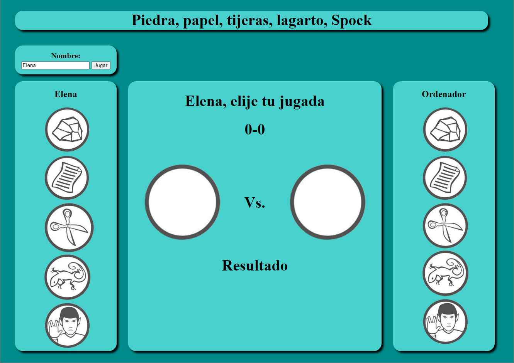

# Piedra, papel, tijeras, lagarto, Spock

## Reglas del juego

Este juego es una expansión del juego clásico *Piedra, papel o tijeras*, al que se le añaden otras dos opciones nuevas: *Lagarto* y *Spock*. Con estos cinco elementos, las reglas serían las siguientes:

- Tijeras cortan papel.
- Papel tapa piedra.
- Piedra aplasta lagarto.
- Lagarto envenena a Spock.
- Spock rompe tijeras.
- Tijeras decapitan lagarto.
- Lagarto devora papel.
- Papel desautoriza a Spock.
- Spock vaporiza piedra.
- Piedra aplasta tijeras.

## Funcionamiento

Al entrar en el juego, mediante el archivo [index.html](Act_Alvaro/index.html), el usuario deberá escribir su nombre en el cuadro de texto y pulsar el botón *Jugar*. El nombre aparecerá en la parte superior de la columna izquierda.

Una vez introducido el nombre, el juego arrancará. El usuario podrá entonces elegir una de las cinco opciones de la columna de la izquierda. Al pasar el cursor por encima de las imágenes, éstas aumentarán ligeramente, volviendo al tamaño original cuando el cursor deja de situarse encima de ellas. Para seleccionar una opción, el usuario deberá hacer clic sobre la misma.

Después de seleccionar una opción, la columna central reflejará la elección del usuario dentro del círculo izquierdo. Entonces, el jugador *Ordenador* seleccionará una de las cinco opciones posibles de manera aleatoria y se mostrará en el círculo derecho de la columna central. 

En la parte inferior de la columna central aparecerá *¡Has ganado!* cuando la opción del usuario gane a la del ordenador, *¡Has perdido!* cuando la opción del ordenador gane a la del usuario y *Empate* cuando ambas opciones sean la misma. Del mismo modo, el marcador situado en la parte superior añadirá un punto en el lado del vencedor.

En cualquier momento, el usuario puede reiniciar la partida escribiendo un nuevo nombre en el cuadro de texto y volviendo a pulsar el botón *Jugar*. El juego volverá a su estado inicial, con los círculos centrales en blanco y el marcador a 0-0.

## Versiones

En el desarrollo de este proyecto se han creado tres versiones diferentes del juego, una por cada miembro del grupo. Cada una de las versiones cuenta con una interfaz diferente, aunque el funcionamiento del juego es el mismo. A continuación podemos observar las otras dos versiones.

## Lenguajes utilizados

Para elaborar este proyecto se han utilizado los siguientes lenguajes:

- HTML
- CSS
- JavaScript

## Autores

Este proyecto ha sido desarrollado como parte de la asignatura *Desarrollo de interfaces*. Los componentes del *Grupo 9* son:

- Elvira Medina Velilla
- María Moreno Rodríguez
- Álvaro Tercero Nieves

